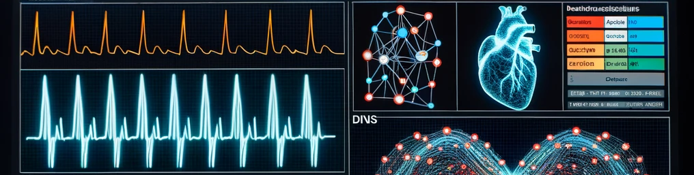

# CNN Autoencoder for Anomaly Detection in ECG Data




 This repository contains a CNN autoencoder trained on the PTBDB dataset to identify abnormal heart rhythms. It employs various loss functions for model optimization and provides comprehensive visualizations of the results.

## 📖 Table of Contents
- [CNN Autoencoder for Anomaly Detection in ECG Data](#cnn-autoencoder-for-anomaly-detection-in-ecg-data)
  - [📖 Table of Contents](#-table-of-contents)
  - [📌 Overview](#-overview)
  - [📊 Dataset](#-dataset)
  - [⚙️ Workflow:](#️-workflow)
    - [1. Data Pre-processing:](#1-data-pre-processing)
    - [2. Device Check:](#2-device-check)
    - [3. Model Training \& Evaluation:](#3-model-training--evaluation)
    - [4. Best Model Selection:](#4-best-model-selection)
    - [5. Classification \& Metrics Calculation:](#5-classification--metrics-calculation)
  - [🔧 Dependencies](#-dependencies)
  - [🚀 Usage](#-usage)
  - [📈 Key Findings](#-key-findings)
  - [📝 Notes](#-notes)
  - [💡 Contributions](#-contributions)
  - [📜 License](#-license)
  - [👤 Authors](#-authors)
  - [🙌 Acknowledgements](#-acknowledgements)

## 📌 Overview
This repository demonstrates the use of Convolutional Neural Networks (CNN) based Autoencoders to perform anomaly detection on Electrocardiogram (ECG) data. Given ECG samples of normal and abnormal heart rhythms, the model aims to learn the intrinsic representation of the normal data using an autoencoder, then differentiate between normal and abnormal data based on the reconstruction error.

## 📊 Dataset

This dataset consolidates heartbeat signals from the renowned MIT-BIH Arrhythmia Dataset. With a substantial sample size, it serves as a foundation for training advanced neural networks.

The purpose behind the dataset's curation has been to delve into the nuances of heartbeat classification employing deep neural network models and to discern the potential of transfer learning on such datasets. Each signal in the dataset portrays the ECG patterns of heartbeats, categorized into normal and those influenced by various arrhythmias and myocardial infarction. Each signal has undergone preprocessing and segmentation to represent individual heartbeats.

**Arrhythmia Dataset** :
- Samples: 109,446
- Categories: 5
- Frequency: 125Hz
- Origin: Physionet's MIT-BIH Arrhythmia Dataset
- Class Labels: ['N': 0, 'S': 1, 'V': 2, 'F': 3, 'Q': 4]

- **File Name:** `ptbdb_normal.csv`, `ptbdb_abnormal.csv`
- **Description:** The datasets contain ECG recordings representing heart rhythms. The former encapsulates normal heartbeats, while the latter captures abnormal rhythms, offering a comprehensive view of cardiac activity variations.

## ⚙️ Workflow:
### 1. Data Pre-processing:
- Load normal and abnormal datasets.
- Drop the target columns to obtain pure data samples.
- Split the normal dataset into training and testing sets.
### 2. Device Check:
- Detect if the code is running on a GPU, a conventional CPU, or an M1/M2 Mac and accordingly select an appropriate optimizer.
### 3. Model Training & Evaluation:
- Train the autoencoder model using different loss functions.
- Determine a threshold value for classification based on the 95th percentile of the reconstruction error on training data.
- Evaluate model performance on combined validation data (normal + anomaly).
- Visualize the reconstructed ECG signals for both normal and anomaly samples.
### 4. Best Model Selection:
- Select the best model based on the minimum average validation error.
### 5. Classification & Metrics Calculation:
- Classify reconstruction errors as either normal or anomaly.
- Calculate and display performance metrics like accuracy, precision, recall, F1-score, and display the confusion matrix.

## 🔧 Dependencies

To run the notebook, you'll need the following libraries:

- numpy
- pandas
- matplotlib
- seaborn
- platform
- tensorflow
- scikit-learn

You can install these using `pip`:

```bash
pip install pandas numpy matplotlib scikit-learn seaborn platform tensorflow
```

## 🚀 Usage

1. **Clone the repository:**

   ```bash
   git clone https://github.com/jorgesandoval/heartbeat-classification-cnn.git
    ```
2. **Navigate to the cloned directory and open the Jupyter notebook"**

    ```bash
    cd heartbeat-classification-cnn
    jupyter notebook
    ```
3. **Run the notebook**: Execute the notebook cells sequentially to preprocess the data, train the CNN Autoencoder model, and evaluate its performance.

## 📈 Key Findings
* The model achieved an accuracy of 99.66% in classifying ECG rhythms.
* The precision score is 99.64%, indicating the proportion of positive identifications that were actually correct.
* A recall of 100.00% means the model correctly identified all actual positives.
* The F1 Score, a measure of the model's accuracy considering both precision and recall, stands at 99.82%.
These metrics reflect the model's capability in ECG anomaly detection.

## 📝 Notes

* For best results, adjust hyperparameters like batch size, epochs, or the architecture of the AutoEncoder class.
*  Ensure GPU support is enabled if available to speed up the training process.

## 💡 Contributions

Contributions to this repository are very welcome! Whether it's fixing bugs, improving the documentation, adding new features, or providing feedback, your insights can help improve this project. Here's how you can contribute:

1. **Fork the Project**
* Navigate to the main page of the repository.
* Click on the Fork button on the top right.

2. **Create Your Feature Branch**
    ```bash
    git checkout -b feature/AmazingFeature
    ```

3. **Commit Your Changes**
    ```bash
    git commit -m 'Add some AmazingFeature'
    ```
4. **Push to the Branch**
    ```bash
    git push origin feature/AmazingFeature
    ```
5. **Open a Pull Request**
* Navigate back to the main page of your forked repository.
* Click on the "Pull requests" tab.
* Click on the green "New pull request" button.


## 📜 License

Distributed under the MIT License. See [LICENSE](https://opensource.org/licenses/MIT) for more information.

## 👤 Authors
* [Jorge Sandoval](https://www.linkedin.com/in/jorge-g-sandoval/)

## 🙌 Acknowledgements

Acknowledgment is extended to Mohammad Kachuee, Shayan Fazeli, and Majid Sarrafzadeh for their work, "ECG Heartbeat Classification: A Deep Transferable Representation." as documented in arXiv preprint arXiv:1805.00794 (2018).